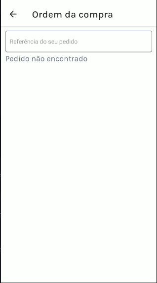

<h1 align="center">E-Nike Mobile</h1>

<p align="center">
  

  

  
  
  <a href="https://github.com/williamjayjay/Github-Blog/commits/master">
    
  </a>
    
   <a href="https://github.com/williamjayjay/nike-app-clone/stargazers">
    
  </a>
</p>

<p align="center"><p align="center">
Este aplicativo tem como principais funcionalidades a busca de dados de tênis a partir de uma API mockada, a exibição em uma lista, a apresentação dos detalhes de cada tênis em uma tela dinâmica, o controle do estado global utilizando Redux toolkit e a implementação do gateway de pagamentos da Stripe para possibilitar compras diretamente pelo app.</p>

<p align="center">

</p>

## 🥶 Sobre o projeto

Desenvolvi esse projeto para como forma de reforçar o conhecimento com Redux e gateway de pagamentos STRIPE.

## Mobile React Native:

**Aplicativo:** O app irá exibir uma lista de tênis e também deverá ser possível realizar pagamentos com cartão pelo gateway de pagamentos da stripe.

## 🚀 Tecnologias

Principais tecnologias que utilizei para desenvolver esta aplicação

- [Typescript](https://www.typescriptlang.org/)
- [React-Navigation](https://reactnavigation.org/)
- [Expo-Font](https://docs.expo.dev/versions/latest/sdk/font/)
- [NativeWind](https://www.nativewind.dev/quick-starts/expo)
- [TailwindCSS](https://www.nativewind.dev/)
- [React-Native-Toast-Message](https://www.npmjs.com/package/react-native-toast-message)
- [Classnames](https://www.npmjs.com/package/classnames)
- [React-Native-Safe-Area-Context](https://docs.expo.dev/versions/latest/sdk/safe-area-context/)
- [Redux Toolkit](https://redux-toolkit.js.org/introduction/getting-started)
- [Stripe RN](https://docs.expo.dev/versions/latest/sdk/stripe/)

## Guia de inicialização

Para instalar e configurar uma cópia local, siga estas etapas simples:

### Prerequisitos

Para garantir o funcionamento adequado da nossa aplicação, verifique abaixo:

1. **Clone o repositório**:
  ```sh
  git clone https://github.com/williamjayjay/nike-app-clone
  ```

2. **Navegue na raiz do projeto nike-app-clone:**

3. **Instale os módulos:**
  ```sh
  bun i
  ```

4. **Copie o .env de exemplo:** 

5. **Passe as url e credênciais correspondentes no arquivo .env** 

6. **Rode o aplicativo:**
  ```sh
  bun android
  ```

## Roadmap

- [x] Iniciar o aplicativo, entrar na tela com listagem dos tênis nike.

- [x] Na tela de ordem de compras deve exibir os pedidos realizados.

- [x] Ao clicar em um tênis deve levar para tela de detalhes do tênis.

- [x] Ao clicar em adicionar deve adicionar ao carrinho.

- [x] Deve exibir toast notification ao adicionar ao carrinho.

- [x] Na tela do carrinho deve exibir os produtos adicionados.

- [x] Deve exibir toast notification ao remover o último produto do carrinho.

- [x] Quando clicar em finalizar, deve abrir o modal checkout da stripe.

- [x] Ao preencher corretamente os dados, deve ser possível realizar o pagamento do produto.

<!-- --------------------- -->

| Tela Produtos | Tela Detalhes |
|:-------------------------:|:-------------------------:|
|  |  |

| Tela Ordem de Compra | Tela Carrinho |
|:-------------------------:|:-------------------------:|
|  |  |

| Tela Checkout Stripe |
|:-------------------------:|
|  |